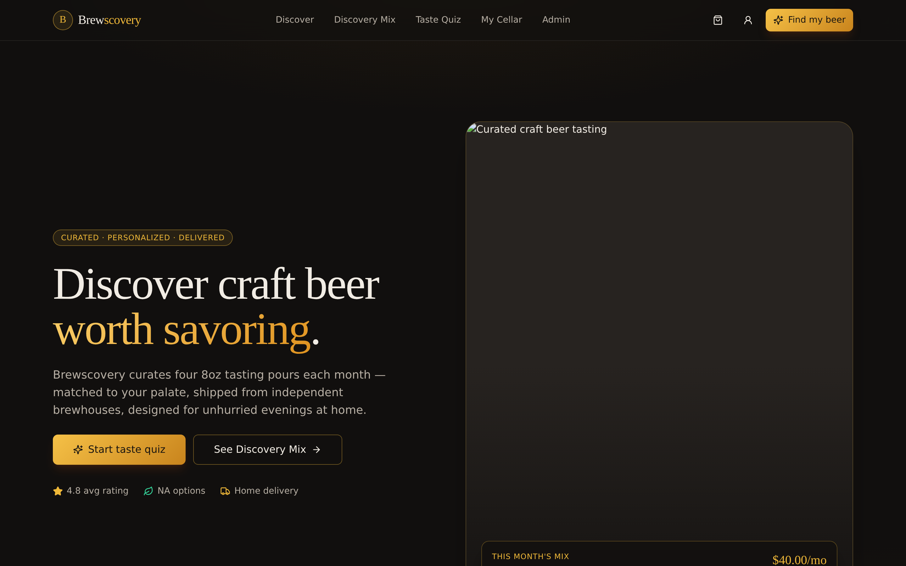
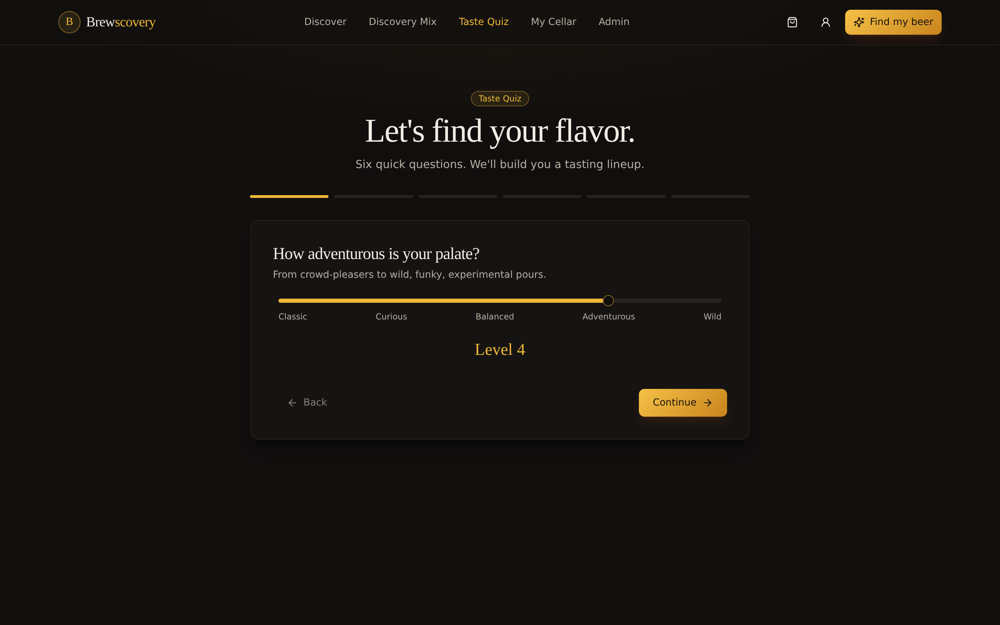
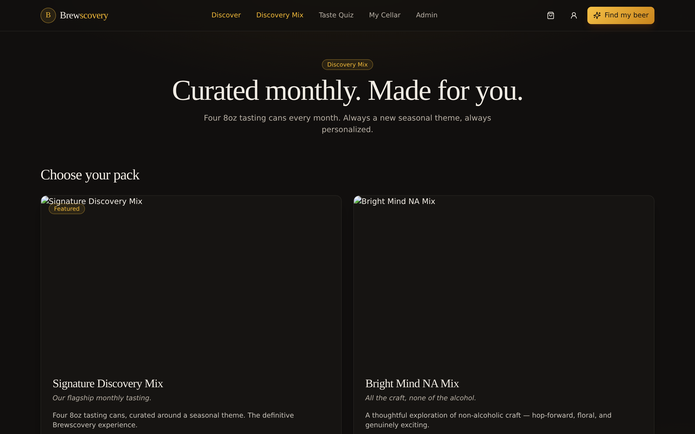
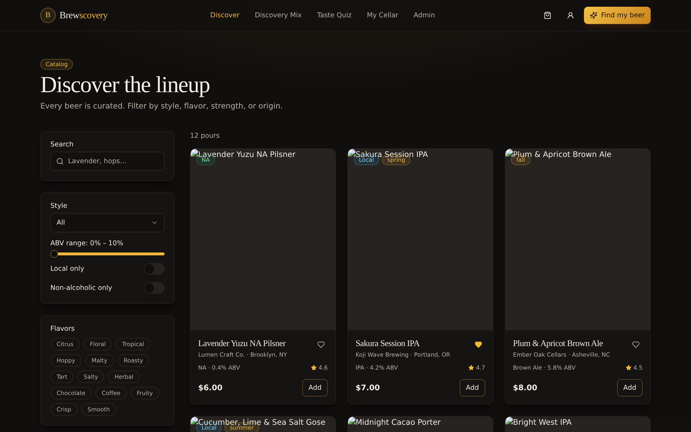
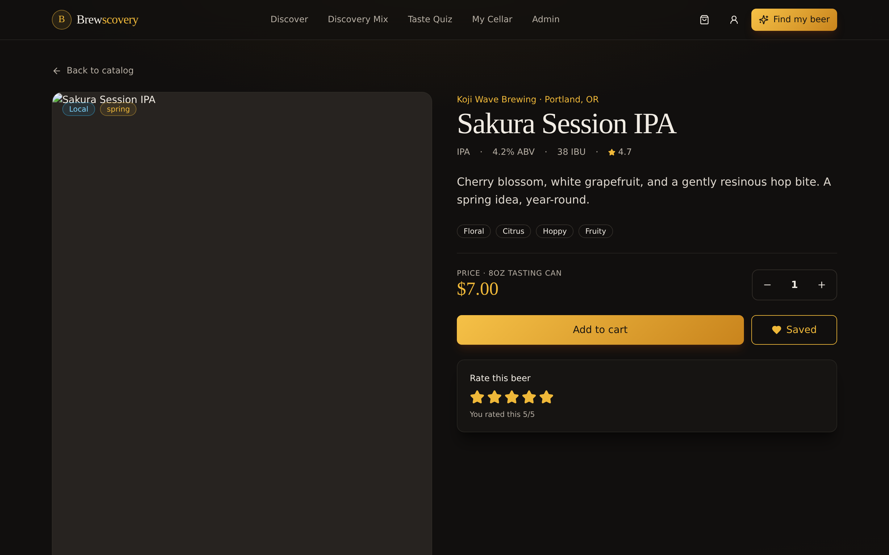
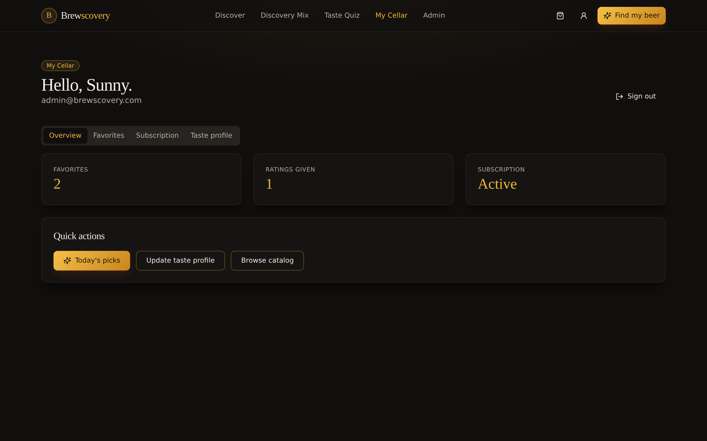
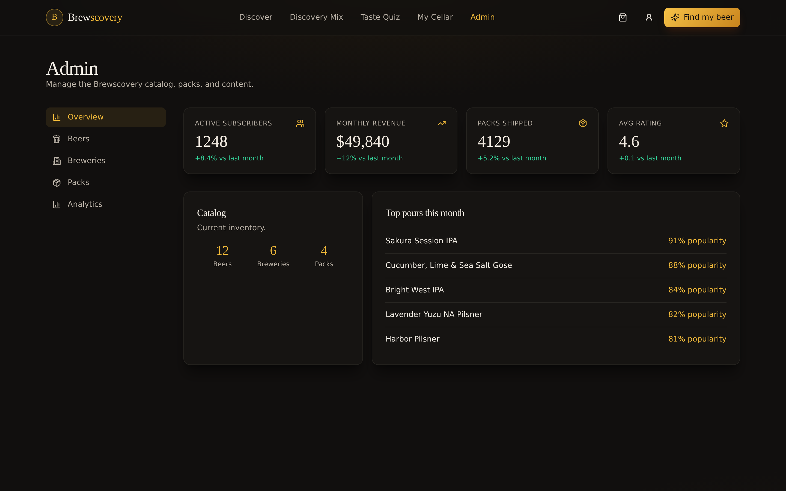

<div align="center">

# 🍺 Brewscovery

### Premium craft beer discovery & subscription — curated tasting packs, personalized recommendations, and independent brewhouses, delivered.

[](https://nextjs.org/)
[](https://www.typescriptlang.org/)
[](https://tailwindcss.com/)
[](https://ui.shadcn.com/)
[](#license)

</div>

---

## 🎯 Product

Brewscovery is a portfolio-grade full-stack product demo centered on **Discovery Mix** — a monthly curated tasting pack of four 8oz pours, matched to each drinker's palate. The product promise: *curated selection, personalization, home delivery, smaller tasting quantities, local brewery support, and responsible drinking from home.*

Every page is built around that promise: a premium dark brand system, a taste-quiz onboarding, transparent rules-based recommendations, a subscription-first cart, and a real admin surface for managing the catalog.

---

## ✨ Feature Highlights

| Customer | Admin |
|---|---|
| Age gate on first visit | KPI overview (subscribers, revenue, shipments, avg rating) |
| Mock auth (sign-in / sign-up / admin role via email) | Beers CRUD with dialog editor |
| 6-step taste quiz (adventure / styles / flavors / ABV / NA / local) | Brewery & Discovery Mix pack management |
| Catalog with search + style / ABV / flavor / local / NA filters | Retention chart + conversion funnel analytics |
| Beer detail (tasting notes, flavors, favorites, 5-star rating) | Admin-gated routes (`admin@brewscovery.com` login) |
| Brewery profile pages with origin story + full lineup | |
| Discovery Mix: 4 curated packs + personalized lineup with **match scores** + reasons | |
| Cart + test-mode checkout → activates subscription | |
| Customer dashboard: favorites / subscription (pause / resume / cancel) / taste profile | |

---

## 🧠 Recommendation Engine (rules-based, explainable)

Instead of a black-box model, Brewscovery scores each beer against the user's palate on **7 transparent signals** (see [`lib/recommendations.ts`](lib/recommendations.ts)):

| Signal | Max points | Why it matters |
|---|---:|---|
| Flavor overlap | 30 | Strongest single predictor |
| Style preference | 20 | Direct user choice |
| ABV fit | 15 | Penalized when outside range |
| Local preference | 10 | Supports independent brewhouses |
| Non-alcoholic interest | 10 | Boosts / demotes NA explicitly |
| Adventure fit | 10 | Matches Sours / Saisons to high-adventure, classics to low |
| Popularity + rating prior | 5 | Light social proof tiebreaker |

Each recommendation card surfaces its top reasons to the customer — so "85% match · Matches 2 flavors you love · Local brewery" shows up right on the card.

---

## 🧱 Architecture

```
app/
  layout.tsx             → Root shell: Providers + Age gate + Header + Footer
  page.tsx               → Marketing home
  onboarding/            → 6-step taste quiz
  discover/              → Filterable catalog
  beer/[slug]/           → Beer detail + related
  brewery/[slug]/        → Brewery profile
  discovery-mix/         → Curated packs + personalized lineup
  cart/  checkout/       → Cart + test checkout
  auth/sign-in, sign-up  → Mock auth
  dashboard/             → Customer: favorites / subscription / taste profile
  admin/                 → Admin layout, beers/breweries/packs/analytics
components/
  ui/                    → shadcn/ui primitives (button, card, dialog, …)
  site/                  → Header, footer, age gate, providers
  beer/beer-card.tsx     → Core domain card
lib/
  data/                  → Seeded breweries, beers, packs
  store/                 → Client state (auth, cart, preferences)
  recommendations.ts     → Rules-based taste-match scoring
  types.ts               → Domain model
  utils.ts               → cn / formatCurrency / slugify
```

### State & Persistence
All client state lives in `localStorage`:

| Key | Purpose |
|---|---|
| `brewscovery:user` | Mock auth, favorites, ratings, subscription |
| `brewscovery:prefs` | Taste profile |
| `brewscovery:cart` | Cart items |
| `brewscovery:age-confirmed` | Age-gate confirmation |

Admin CRUD operates on an in-session in-memory copy of the seeded catalog — designed so swapping to a real database (Prisma + Postgres) is a one-file change in `lib/data`.

---

## 🎨 Design System

- **Foundation:** shadcn/ui only — no other UI kits
- **Palette:** deep charcoal (`--background`), amber gold (`--primary`), warm cream text
- **Typography:** serif display + clean sans body
- **Motion:** restrained — no gradient spam, no glass-UI clichés
- **Imagery:** editorial, high-contrast, warm-shadowed

---

## 🚀 Getting Started

```bash
# 1. Install
npm install

# 2. Run
npm run dev

# 3. Open
# http://localhost:3000
```

### Walk the full flow
1. Confirm the age gate
2. **Start taste quiz** → complete the 6 steps
3. Land on `/discovery-mix` and see your personalized lineup with match scores
4. Add **Signature Discovery Mix** to cart
5. `/auth/sign-up` → create an account
6. `/checkout` → place a test order → subscription activates
7. `/dashboard` → pause or cancel the subscription
8. Sign in as `admin@brewscovery.com` (any password) → unlock `/admin`

---

## 📸 Screenshots

**Home — marketing landing**


**Taste quiz — onboarding**


**Discovery Mix — curated packs + personalized lineup with match scores**


**Catalog — filterable beer discovery**


**Beer detail — tasting notes, flavors, ratings**


**Customer dashboard — subscription, favorites, taste profile**


**Admin overview — KPIs and catalog management**


---

## 📦 Tech Stack

- **Framework:** Next.js 14 (App Router) + TypeScript 5
- **UI:** shadcn/ui + Tailwind CSS + Radix UI + lucide-react
- **State:** React Context + `localStorage`
- **Images:** Unsplash (remote)
- **Dev tooling:** ESLint, strict TypeScript, PostCSS

---

## 🗺️ Roadmap

- [ ] Prisma + Postgres behind `lib/data`
- [ ] NextAuth (real sign-in with magic link)
- [ ] Stripe subscriptions (test mode)
- [ ] Supabase / Cloudinary for brewery imagery
- [ ] Order history
- [ ] Vitest + Playwright (unit + e2e)
- [ ] Responsive polish pass
- [ ] Deploy to Vercel

---

## ⚠️ Responsibility

Brewscovery's concept centers on **smaller 8oz tasting pours** and **thoughtful curation over volume**. The UI includes an age gate and responsibility messaging as first-class elements.

---

## License

MIT © Brewscovery demo
